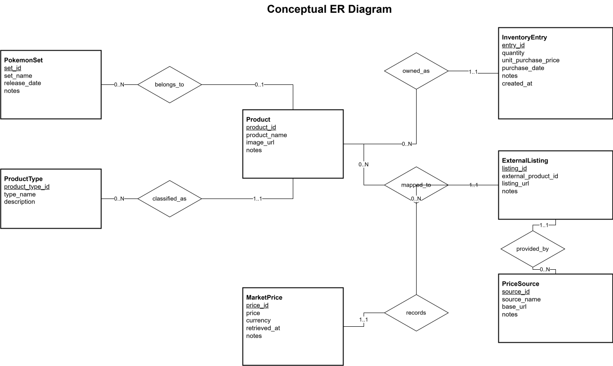
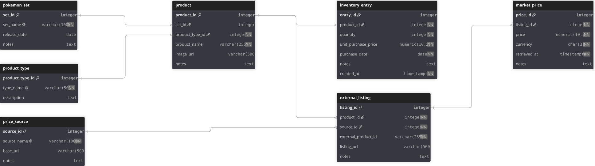

# Sealed Pokémon Inventory Tracker

A web application for tracking sealed Pokémon TCG inventory, purchase history, and market value.

## Database Design

### ER Diagram

### Relational Schema

## Documentation

- [Project Scope](./docs/project-scope.md)
- [Software Requirements Specification](./docs/SRS.md)
- [Database Design](./docs/database-design.md)
